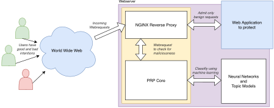

> **Attention: This is a students' project, not a (fully) functional product.**

> *Adding a layer of protection in front of a web application does not guarantee perfect security.
> Always make sure to secure the main web application using best practices!*

# **P**rotective**R**everse**P**roxy



The Protective Reverse Proxy (PRP) is a Docker container to place in front of a web service to protect it.

## About

All incoming requests towards the web application to protect are intercepted by the PRP and then redirected to the intrusion detection system (PRP core). 
The PRP system uses both neural networks and topic models to determine whether the request is malicious or benign. 
Benign requests are admitted and consequently forwarded to the protected web application. Requests classified as attacks are blocked and the system responds with a dummy html page.

## Usage

See [Installation ↓](#installation) for detailed step-by-step instructions. In most cases, it is enough to 
simply download the [docker-compose.yml](docker-compose.yml)
and run `docker-compose up` in the directory. A dummy system (using an example application and a dummy model) is reachable at `http(s)://localhost`.

### Installation

1. The system has to be installed via Docker. Hence, you need a server running Docker. It is recommended to use docker-compose.
2. You need a web application to be protected by PRP. It works best if the application also runs in a Docker container.
	- If the application does *not* run a Docker container, you have to make the host accessible in the network created by docker-compose. This can be achieved by using [`extra_hosts`](https://docs.docker.com/compose/compose-file/compose-file-v2/#extra_hosts):  
	Add the following lines to the service `protection_proxy`
		```yml
		extra_hosts:
		  - "system-to-protect:host.docker.internal"
		```
	- Make sure to protect the application from direct access, such that it is only accessible via PRP.
3. Create a custom `docker-compose.yml`, see the example [here](docker-compose.yml). Note the following remarks.
	- `volumes`
		- You should use SSL to access the application, PRP comes with a dummy certificate
			which **is insecure**. Please bind-mount a custom certificate to
			`/etc/ssl/private/self_sslkey.pem` and `/etc/ssl/certs/self_sslcert.pem`.
		- PRP comes with a default dummy model for the setup process, not optimized for security. Take a look
			at the [ModelGeneration](https://github.com/CaseStudyIntrusionDetection/ModelGeneration)
			repository to generate your own models or contact us for a real model.
			- A model is a directory containing an `index.json` file. Bind-mount the directory to `/protection/model/` (as currently done with `./models/dummy`).
		- Uncomment the bind-mount for `/proxy/logs` to preserve the logs generated when `LOG_REQUESTS` is active.
	- `environment`
		- See the [Configuration Options ↓](#configuration-options)
		- Only `BLOCK_CRAWLING` is required for basic usage.
	- `ports`
		- Remove port `80` if the application should not be reachable via unencrypted requests.
			Also remove port `443` if no custom SSL certificates were bind-mounted.
	- **Add the application**
		- Add a new service `system_to_protect` (by replacing/ changing the example application).
4. Start via `docker-compose up -d`
	- The application will be reachable at port 80 or 443.
	- For a short period of time an error `502 – Bad gateway` will show up.
		This is caused by the PRP core starting up and loading the models.
	- Also take a look at [Special Installation ↓](#special-installation) and [Troubleshooting ↓](#troubleshooting). 

#### Special Installation

- Configuring the used NGINX reverse proxy.
	- The used configuration can be found [here](conf/proxy.conf).
	- The PRP core will redirect to the location `@protected`.
	- Bind-Mount a custom file via `./my-proxy.conf:/etc/nginx/sites-enabled/default`.
- Changing the code itself.
	- See [DEVELOPMENT →](DEVELOPMENT.md)

### Configuration Options

All configuration is done via environmental variables which are listed and explained below.
They should be specified in the `docker-compose.yml`.

- `BLOCK_CRAWLING` (**required**)
	- `true` or `false` 
	- Choose if request crawling e.g. for security flaws should be blocked also. Only blocks attacks when `false`.
- `ALLOW_TYPES` (optional, default empty)
	- Empty or some of `sql,xss,tampering,execution,disclosure,overflows,encryption,cve,redirect`; separate by `,` 
	- Choose to allow request of some attack types nevertheless they look malicious. Won't allow any types if empty. 
- `BLOCK_TYPES` (optional, default empty)
	- Empty or some of `sql,xss,tampering,execution,disclosure,overflows,encryption,cve,redirect`; separate by `,` 
	- Choose one or more classes of attack types to block directly, e.g. to use together with `ALLOW_TYPES`.
		Will block any request looking malicious and not in `ALLOW_TYPES` if empty. 
- `APPROACH_USE` (optional, default `lda,nn`)
	- `lda` or `nn` or `lda,nn`
	- Determine which technique should be used for the proxy. `lda` specifies the model generated by our 
		Topic Modeling approach. `nn` specifies the usage of the model generated by Neural Network approach. 
		If `lda,nn` is specified, the system will use both techniques for classification and logically
		connect them via `APPROACH_CONNECTOR`. 
- `APPROACH_CONNECTOR` (optional, default `or`)
	- `and` or `or`
	- Specifies whether a request is assumed to be safe if both models consider it to be safe (`and`)
		or if it is sufficient for one model to consider the request to be safe (`or`).
- `MAIL_HOST` (required if `MAIL_TO` is set)
	- SMTP server's hostname
	- A hostname of the SMTP server to use when sending notification mails. The system uses authentication via STARTTLS.
- `MAIL_PORT` (required if `MAIL_TO` is set)
	- Port as integer value, e.g. `587`
	- The port for the SMTP server.
- `MAIL_USERNAME` (required if `MAIL_TO` is set)
	- Username
	- The username for the email account to send emails from.
- `MAIL_PASSWORD` (required if `MAIL_TO` is set)
	- Password as plain string (make sure to escape special chars according to docker-compose)
	- The password for the email account to send emails from.
- `MAIL_FROM` (required if `MAIL_TO` is set)
	- Email address
	- The email address which sends the notifications emails (`From` header).
- `MAIL_TO` (optional, default disables notifications)
	- Email address
	- The email address which receives the notification emails.
- `SEND_DAILY_REPORT` (optional, default `false`)
	- `true` or `false` 
	- Specifies whether a daily report of attack attempts should be sent to
		the email address set via `MAIL_TO`. Requires all `MAIL_*` to be set. 
- `SEND_EMERGENCY` (optional, default `false`)
	- `true` or `false` 
	- Specifies whether an emergency email should be sent to the email address
		set via `MAIL_TO`. Such messages are sent whenever an attack arrives, but at most
		once per hour. Requires all `MAIL_*` to be set.
- `ALLOW_AFTER_CAPTCHA` (optional, default `false`)
	- `true` or `false` 
	- Specifies whether requests should be allowed after a captcha has been
		solved correctly.
- `LOG_REQUESTS` (optional, default `none`)
	- `all` or `attack` or `none`
	- Specifies whether all requests, only attacks or no requests should be logged
		to `/proxy/logs` to be learned later. **The log may contain private data
		sent to the server.** 

### Troubleshooting

- After configuring the SMTP Email notifications you can send a test mail by 
	running `docker exec --user www-data protection_proxy python /proxy/mail.py`.
	Run `docker exec --user www-data protection_proxy python /proxy/mail.py --debug` to get debug output.
- Logs can be found at `/tmp/prp.log` and printed by
	`docker exec --user www-data protection_proxy tail -n 20 /tmp/prp.log`.
	Only errors are logged by default.
